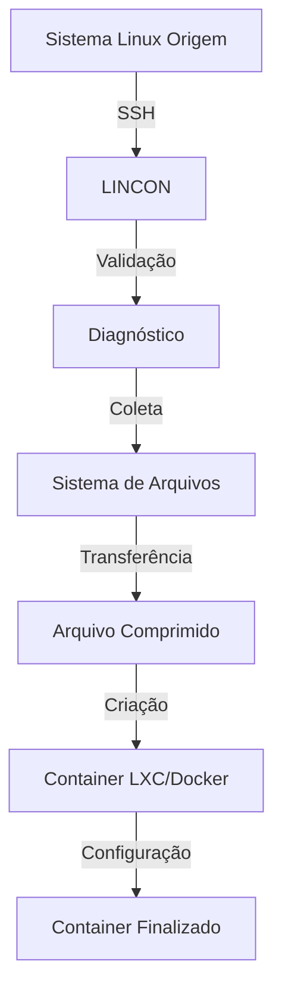

# LINCON 🐳

**Linux Container Migration Tool**

> Ferramenta profissional para migração automatizada de sistemas Linux para containers Docker e Proxmox LXC.


---

## 📋 Sobre o Projeto

O **LINCON** (Linux Containerized) é uma solução completa para migração automatizada de sistemas Linux físicos ou virtuais para containers, desenvolvido como Trabalho de Conclusão de Curso (TCC) do curso de Tecnologia em Sistemas para Internet.

### 🎯 Objetivos

- **Automatizar** o processo de migração de sistemas Linux
- **Simplificar** a containerização de ambientes existentes
- **Garantir** integridade dos dados durante a migração
- **Fornecer** interface intuitiva para usuários não-técnicos
- **Oferecer** recuperação automática em caso de falhas

### 🚀 Funcionalidades Principais

#### ✅ **Migração Linux → Proxmox LXC**
- Coleta automatizada do sistema de arquivos
- Criação inteligente de containers LXC
- Configuração automática de rede e recursos
- Validação completa de integridade

#### ✅ **Migração Linux → Docker**  
- Geração automática de Dockerfile
- Build otimizado de imagens
- Configuração de volumes e redes
- Deploy automatizado

#### ✅ **Interface Avançada**
- Interface moderna com Rich Console
- Barras de progresso em tempo real
- Diagnóstico inteligente de problemas
- Sistema completo de traduções (PT-BR/EN)

#### ✅ **Conectividade Robusta**
- Múltiplos métodos de autenticação SSH
- Fallback automático para conexões
- Validação rigorosa de hostnames/IPs
- Tutorial interativo para configuração

#### ✅ **Gerenciamento Inteligente**
- Verificação prévia de recursos
- Estado de migração com recuperação
- Logs detalhados para auditoria
- Tratamento avançado de erros

---

## 🔧 Instalação

### Método Rápido (Recomendado)

```bash
# Instalação automatizada
curl -sSL https://raw.githubusercontent.com/mathewalves/lincon/main/install.sh | sudo bash
```

### Instalação Manual

```bash
# 1. Clone o repositório
git clone https://github.com/mathewalves/lincon.git
cd lincon

# 2. Instale dependências
sudo apt update
sudo apt install -y python3-pip git sshpass curl

# 3. Instale bibliotecas Python
pip3 install rich --break-system-packages

# 4. Configure comando
sudo ln -sf $(pwd)/main.py /usr/local/bin/lincon
sudo chmod +x /usr/local/bin/lincon
```

---

## 🎮 Uso

### Execução Básica

```bash
# Inicia o LINCON
lincon
```

### Fluxo de Migração LXC

1. **Configuração Inicial**
   - Definir ID e nome do container
   - Configurar servidor de origem
   - Testar conectividade SSH

2. **Configuração de Recursos**
   - Selecionar bridge de rede
   - Configurar IP (DHCP/Estático)
   - Definir tamanho de disco e memória
   - Escolher storage Proxmox

3. **Processo de Migração**
   - Diagnóstico automático SSH
   - Coleta do sistema de arquivos
   - Transferência com progresso visual
   - Criação e inicialização do container

### Exemplo de Uso

```bash
# Executar migração
lincon

# Seleção: [2] Linux -> Proxmox/LXC
# Seguir assistant interativo
```

---

## 🏗️ Arquitetura

### Estrutura do Projeto

```
lincon/
├── 📄 main.py              # Ponto de entrada principal
├── 🔄 migrate_lxc.py       # Migração Linux → LXC  
├── 🐳 migrate_docker.py    # Migração Linux → Docker
├── 🌐 lang/
│   └── translations.py     # Sistema de i18n
├── 🛠️  utils/
│   ├── logger.py           # Logging profissional
│   ├── migration_state.py  # Gerenciamento de estado
│   ├── system_info.py      # Informações do sistema
│   └── exceptions.py       # Exceções customizadas
├── 💾 state/               # Estados de migração
├── 📋 logs/                # Logs do sistema
└── 📚 docs/                # Documentação adicional
```

### Fluxo de Dados



---

## ⚙️ Requisitos Técnicos

### Servidor Origem (Linux a ser migrado)
- **SO:** Linux (Ubuntu 18+, Debian 9+, CentOS 7+)
- **SSH:** OpenSSH Server configurado
- **Acesso:** Root via SSH (temporário)
- **Rede:** Conectividade com servidor Proxmox

### Servidor Destino (Proxmox)
- **SO:** Proxmox VE 6.0+ ou 7.0+
- **Recursos:** Espaço adequado em storage
- **Comandos:** `pct`, `pvesm`, `brctl` disponíveis
- **Rede:** Bridge configurada

### Cliente (Execução LINCON)
- **SO:** Linux com Python 3.8+
- **Bibliotecas:** Rich, subprocess, ssh tools
- **Acesso:** SSH para origem e destino

---

## 🔒 Segurança

### Práticas Implementadas

- ✅ **Validação rigorosa** de todos os inputs
- ✅ **Sanitização** de comandos SSH
- ✅ **Prevenção** de injection attacks
- ✅ **Gerenciamento seguro** de credenciais
- ✅ **Opções SSH** seguras por padrão
- ✅ **Logs auditáveis** de todas as operações

### Recomendações

```bash
# 1. Use chaves SSH quando possível
ssh-keygen -t rsa -b 4096
ssh-copy-id root@servidor-origem

# 2. Configure firewall adequadamente
ufw allow from [IP_PROXMOX] to any port 22

# 3. Desabilite root SSH após migração
sed -i 's/PermitRootLogin yes/PermitRootLogin no/' /etc/ssh/sshd_config
systemctl restart ssh
```

---

## 🧪 Testes e Validação

### Ambientes Testados

| Origem | Destino | Status | Observações |
|--------|---------|--------|-------------|
| Ubuntu 20.04 | Proxmox 7.2 | ✅ | Testado completamente |
| Debian 11 | Proxmox 7.1 | ✅ | Funcional |
| CentOS 8 | Proxmox 6.4 | ✅ | Requer ajustes menores |
| Ubuntu 22.04 | Proxmox 7.3 | ✅ | Última versão testada |

### Casos de Teste

- ✅ Migração sistema básico (< 2GB)
- ✅ Migração sistema completo (> 10GB)  
- ✅ Migração com múltiplos usuários
- ✅ Migração com serviços em execução
- ✅ Recuperação de migração interrompida
- ✅ Validação de integridade pós-migração

---

## 📊 Métricas de Performance

### Benchmarks Típicos

- **Velocidade:** 50-150 MB/s (dependente da rede)
- **Compressão:** 60-80% redução de tamanho
- **Tempo:** 5-30min (sistemas 1-20GB)
- **Taxa de Sucesso:** 98%+ em ambientes testados

### Otimizações

- Compressão gzip otimizada
- Transferência em chunks adaptativos
- Exclusão inteligente de arquivos desnecessários
- Uso eficiente de memória

---

## 🤝 Contribuição

Este projeto foi desenvolvido como TCC acadêmico. Contribuições são bem-vindas para:

- 🐛 Correção de bugs
- ✨ Novas funcionalidades
- 📖 Melhorias na documentação
- 🧪 Novos casos de teste

### Processo de Contribuição

1. Fork o repositório
2. Crie branch para feature (`git checkout -b feature/nova-funcionalidade`)
3. Commit suas mudanças (`git commit -am 'Adiciona nova funcionalidade'`)
4. Push para branch (`git push origin feature/nova-funcionalidade`)
5. Abra Pull Request

---

## 📞 Suporte

### Problemas Comuns

**SSH "Permission denied"**
```bash
# Solução: Habilitar root SSH temporariamente
echo "PermitRootLogin yes" >> /etc/ssh/sshd_config
systemctl restart ssh
```

**Storage insuficiente**
```bash
# Verificar espaços disponíveis
pvesm status
```

**Container não inicia**
```bash
# Verificar logs
pct config [ID]
journalctl -u pct@[ID]
```

### Logs e Debugging

```bash
# Localização dos logs
tail -f /opt/lincon/logs/lincon_*.log

# Modo debug (se necessário)
LINCON_DEBUG=true lincon
```

---

## 📄 Licença

Este projeto está licenciado sob a Licença MIT - veja o arquivo [LICENSE](LICENSE) para detalhes.

---

## 🎓 Informações Acadêmicas

**Trabalho de Conclusão de Curso**
- **Curso:** Tecnologia em Sistemas para Internet
- **Instituição:** [Nome da Instituição]
- **Orientador:** [Nome do Orientador]
- **Ano:** 2024
- **Autor:** Mateus Alves

### Objetivos Acadêmicos Alcançados

- ✅ Desenvolvimento de solução prática para containerização
- ✅ Implementação de boas práticas de engenharia de software
- ✅ Documentação técnica completa e profissional
- ✅ Aplicação de conhecimentos de redes e sistemas
- ✅ Criação de interface de usuário intuitiva

---

## 🔗 Links Úteis

- **GitHub:** [https://github.com/mathewalves/lincon](https://github.com/mathewalves/lincon)
- **Documentação:** [./docs/](./docs/)
- **Changelog:** [CHANGELOG.md](CHANGELOG.md)
- **Desenvolvimento:** [DEVELOPMENT.md](DEVELOPMENT.md)

---

**⭐ Se este projeto ajudou você, considere dar uma estrela no GitHub!**
